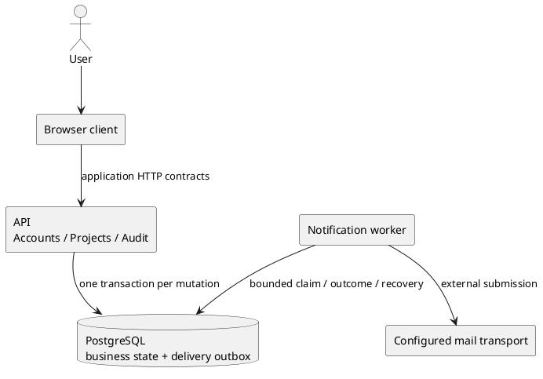
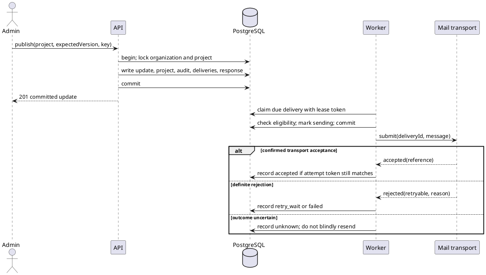

# SPEC-1-Customer Project Portal

> Worked reference design, not a deployed application or a mandatory stack. All product scope, API paths, numbers, role rules, and provider abstractions below are illustrative design decisions. No implementation, performance measurement, provider connection, or host acceptance is claimed. Use this example for internal consistency and handoff depth, not as requirements for another project.

Contents: Background; Requirements; Method (D-01 components, D-02 data, D-03 interfaces, D-04 workflows, D-05 notifications, D-06 operations, D-07 alternatives); Implementation; Milestones; Gathering Results. Read only the relevant contract when consulting this example.

## Background

A services company needs a browser-based customer portal to replace scattered project-status email threads. Customers need a reliable place to read the latest project state; organization administrators need to publish updates and invite the right readers.

For this example, delivery includes all Must requirements and the three explicitly selected Should requirements below. It is not a roadmap that quietly moves difficult Musts beyond the first release.

### Scope and assumptions

| ID | Decision or assumption | Consequence |
|---|---|---|
| ASM-01 | Each account belongs to exactly one organization; the same email can have separate accounts in different organizations | Login identifies the organization as well as the email. Cross-organization account switching is outside this scope. |
| ASM-02 | Public registration creates a new organization and its owner. Existing organizations are joined only through an invitation | Registration cannot claim an existing organization by supplying its name or slug. |
| ASM-03 | Initial planning envelope: 200 organizations, at most 100 active accounts per organization, 20,000 total projects, and 20 concurrent browser sessions | A single PostgreSQL-backed service and a separately running worker are a design choice. These are sizing assumptions, not measured capacity. |
| ASM-04 | The team can operate one transactional database and one deployment of the application image in API and worker modes | No independent cache or broker is required initially. Revisit this choice if measured workload exceeds the envelope. |
| ASM-05 | Email is an external side effect. Provider acceptance is distinguishable from recipient delivery, and an interrupted submission can have an unknown outcome | Durable intent, visible outcomes, and reconciliation are required; universal exactly-once or inbox-delivery guarantees are not promised. |

No comparative product research was performed for this illustrative example. Familiar project-list and update-feed interactions are design choices; they are not claims about another company's internal architecture.

## Requirements

### Must Have

| ID | Requirement | Observable acceptance |
|---|---|---|
| R-01 | Users can register a new organization, log in with organization and email, log out, and complete password reset | AC-01: a new owner completes the full account lifecycle; expired or consumed reset links fail; logout and reset invalidate the affected sessions. |
| R-02 | Owners/admins can invite users, and invitees can accept an unexpired invitation and establish their account | AC-02: invitation, message, acceptance, role assignment, expiration, and resend behavior agree. |
| R-03 | Owners/admins can create and edit organization projects | AC-03: valid changes persist; conflicting versions do not overwrite newer data; unauthorized changes fail. |
| R-04 | Active organization users can list projects, view details, and read published updates | AC-04: the browser and API show the same committed project and update history with stable pagination. |
| R-05 | Owners/admins can publish an immutable project update, optionally changing project status | AC-05: update, optional status change, audit event, and notification intents commit together or not at all. |
| R-06 | Publishing notifies the active organization users through email, with recoverable and observable delivery processing | AC-06: one delivery intent per selected recipient exists; known failures retry within policy; uncertain submissions remain visible for reconciliation; receipt is checked against a real mailbox during deployment acceptance. |
| R-07 | Every tenant-owned read, write, and relationship belongs to the authenticated organization | AC-07: a valid identifier from another organization is neither returned nor attachable to a local record. |
| R-08 | Owners/admins can view an audit history of registration, account administration, project changes, publishing, and delivery reconciliation | AC-08: committed administrative changes have attributable events; failed business mutations do not leave success events. |

### Should Have — selected for this delivery

| ID | Requirement | Acceptance |
|---|---|---|
| S-01 | Filter projects by status | AC-09: filtering and paging preserve the selected status and stable ordering. |
| S-02 | Deactivate invited or active non-owner users and revoke their sessions | AC-10: deactivated users cannot authenticate or continue a session; pending invitations cannot activate them. |
| S-03 | Expose request latency/errors and notification state/age/failure observations | AC-11: operators can identify delayed, failed, and unknown deliveries without interpreting an API process as evidence that workers are healthy. |

### Could Have — not committed

Comments on updates, CSV export, and per-organization branding are candidate later work. They have no implementation tasks or launch acceptance criteria in this SPEC.

### Won't Have in this scope

Native mobile clients, real-time collaboration, enterprise SSO, membership in multiple organizations through one account, ownership transfer, hard deletion of organizations/projects/users, and in-place editing of published updates are excluded. A correction is a new published update, not a silent history rewrite.

## Method

### D-01 — Components and ownership

Choose a modular monolith for the API and domain logic, a web client, a PostgreSQL database, and a worker using the same domain package. The database holds both business records and durable notification intents. The worker does not infer work from an in-memory notification or a successful API response.



| Component | Owns | Does not own |
|---|---|---|
| Accounts | Organization creation, identity, sessions, invitations, role/status rules, password reset | Project editing or email transport retries |
| Projects | Project state, optimistic versions, immutable updates, recipient selection | Global user identity or independent delivery state |
| Notifications | Durable delivery intents, claim state, transport adapter, retry/reconciliation | Whether the originating business mutation should commit |
| Audit | Events written in the originating transaction; authorized query projection | A separate best-effort logger pretending to be the business audit |
| Web client | Account forms, project list/detail/update feed, administration and audit views | Authoritative tenant scope, role checks, or acceptance of a mutation |

Module calls are in-process; all persistence access carries an explicit organization context. The application image has independently supervised API and worker entrypoints. A configured mail adapter is required for deployment, but it must implement the internal contract below rather than introduce undocumented vendor behavior into the domain layer.

### D-02 — Identity, tenant boundary, and data

Application-generated identifiers are UUIDs, represented as strings in JSON. Database timestamps are timezone-aware; the API returns UTC ISO-8601 timestamps. Database names use `snake_case`, and response properties use the explicitly mapped `camelCase` names. `DEFAULT now()` initializes timestamps only: every modifying statement must explicitly set `updated_at = now()` and increment the applicable version.

An email address is normalized by the application with trim and lowercase into `email_key`; that is this product's login policy, not a claim that every mail system treats email local parts identically. Organization slugs use a documented lowercase ASCII slug policy and are globally unique. Registration/login/invitation/reset use the same normalization functions.

The following PostgreSQL DDL is the concrete relational core for this example. All foreign keys between tenant-owned entities carry the organization as part of the key. These constraints prevent cross-organization parent relationships; they do not replace scoping reads and authorizing operations in the application. PostgreSQL documents the relevant unique, check, and composite foreign-key semantics in its [constraint reference](https://www.postgresql.org/docs/current/ddl-constraints.html).

```sql
CREATE TABLE organizations (
    id UUID PRIMARY KEY,
    slug TEXT NOT NULL UNIQUE,
    name TEXT NOT NULL,
    created_at TIMESTAMPTZ NOT NULL DEFAULT now(),
    updated_at TIMESTAMPTZ NOT NULL DEFAULT now()
);

CREATE TABLE users (
    id UUID PRIMARY KEY,
    organization_id UUID NOT NULL REFERENCES organizations(id),
    email TEXT NOT NULL,
    email_key TEXT NOT NULL,
    password_hash TEXT,
    role TEXT NOT NULL CHECK (role IN ('owner', 'admin', 'member', 'viewer')),
    state TEXT NOT NULL CHECK (state IN ('invited', 'active', 'deactivated')),
    version BIGINT NOT NULL DEFAULT 1 CHECK (version > 0),
    created_at TIMESTAMPTZ NOT NULL DEFAULT now(),
    updated_at TIMESTAMPTZ NOT NULL DEFAULT now(),
    UNIQUE (organization_id, id),
    UNIQUE (organization_id, email_key),
    CHECK (state <> 'active' OR password_hash IS NOT NULL)
);
CREATE UNIQUE INDEX one_owner_per_organization
    ON users (organization_id) WHERE role = 'owner';

CREATE TABLE sessions (
    id UUID PRIMARY KEY,
    organization_id UUID NOT NULL,
    user_id UUID NOT NULL,
    token_digest TEXT NOT NULL UNIQUE,
    expires_at TIMESTAMPTZ NOT NULL,
    revoked_at TIMESTAMPTZ,
    created_at TIMESTAMPTZ NOT NULL DEFAULT now(),
    FOREIGN KEY (organization_id, user_id)
        REFERENCES users (organization_id, id)
);
CREATE INDEX sessions_user ON sessions (organization_id, user_id);
CREATE INDEX sessions_expiry ON sessions (expires_at);

CREATE TABLE account_tokens (
    id UUID PRIMARY KEY,
    organization_id UUID NOT NULL,
    user_id UUID NOT NULL,
    purpose TEXT NOT NULL CHECK (purpose IN ('invitation', 'password_reset')),
    token_digest TEXT NOT NULL UNIQUE,
    expires_at TIMESTAMPTZ NOT NULL,
    consumed_at TIMESTAMPTZ,
    invalidated_at TIMESTAMPTZ,
    created_at TIMESTAMPTZ NOT NULL DEFAULT now(),
    FOREIGN KEY (organization_id, user_id)
        REFERENCES users (organization_id, id)
);
CREATE INDEX account_tokens_user
    ON account_tokens (organization_id, user_id, purpose);
CREATE INDEX account_tokens_expiry ON account_tokens (expires_at);

CREATE TABLE projects (
    id UUID PRIMARY KEY,
    organization_id UUID NOT NULL REFERENCES organizations(id),
    name TEXT NOT NULL,
    description TEXT NOT NULL DEFAULT '',
    status TEXT NOT NULL CHECK (
        status IN ('planned', 'active', 'blocked', 'completed', 'archived')
    ),
    created_by UUID NOT NULL,
    version BIGINT NOT NULL DEFAULT 1 CHECK (version > 0),
    created_at TIMESTAMPTZ NOT NULL DEFAULT now(),
    updated_at TIMESTAMPTZ NOT NULL DEFAULT now(),
    UNIQUE (organization_id, id),
    FOREIGN KEY (organization_id, created_by)
        REFERENCES users (organization_id, id)
);
CREATE INDEX projects_list
    ON projects (organization_id, created_at DESC, id DESC);
CREATE INDEX projects_filter
    ON projects (organization_id, status, created_at DESC, id DESC);

CREATE TABLE project_updates (
    id UUID PRIMARY KEY,
    organization_id UUID NOT NULL,
    project_id UUID NOT NULL,
    author_id UUID NOT NULL,
    title TEXT NOT NULL,
    body TEXT NOT NULL,
    published_at TIMESTAMPTZ NOT NULL DEFAULT now(),
    UNIQUE (organization_id, id),
    FOREIGN KEY (organization_id, project_id)
        REFERENCES projects (organization_id, id),
    FOREIGN KEY (organization_id, author_id)
        REFERENCES users (organization_id, id)
);
CREATE INDEX project_updates_feed
    ON project_updates (organization_id, project_id, published_at DESC, id DESC);

CREATE TABLE audit_events (
    id UUID PRIMARY KEY,
    organization_id UUID NOT NULL REFERENCES organizations(id),
    actor_user_id UUID,
    action TEXT NOT NULL,
    target_type TEXT NOT NULL,
    target_id UUID,
    details JSONB NOT NULL DEFAULT '{}'::jsonb,
    created_at TIMESTAMPTZ NOT NULL DEFAULT now(),
    UNIQUE (organization_id, id),
    FOREIGN KEY (organization_id, actor_user_id)
        REFERENCES users (organization_id, id)
);
CREATE INDEX audit_events_feed
    ON audit_events (organization_id, created_at DESC, id DESC);

CREATE TABLE mutation_requests (
    organization_id UUID NOT NULL,
    actor_user_id UUID NOT NULL,
    operation TEXT NOT NULL,
    idempotency_key TEXT NOT NULL,
    request_fingerprint TEXT NOT NULL,
    response_status SMALLINT NOT NULL,
    response_body JSONB NOT NULL,
    created_at TIMESTAMPTZ NOT NULL DEFAULT now(),
    PRIMARY KEY (organization_id, actor_user_id, operation, idempotency_key),
    FOREIGN KEY (organization_id, actor_user_id)
        REFERENCES users (organization_id, id)
);

CREATE TABLE notification_deliveries (
    id UUID PRIMARY KEY,
    organization_id UUID NOT NULL,
    source_event_id UUID NOT NULL,
    recipient_user_id UUID NOT NULL,
    kind TEXT NOT NULL CHECK (
        kind IN ('project_update', 'invitation', 'password_reset')
    ),
    payload_version SMALLINT NOT NULL DEFAULT 1 CHECK (payload_version = 1),
    payload JSONB NOT NULL,
    state TEXT NOT NULL DEFAULT 'pending' CHECK (state IN (
        'pending', 'leased', 'sending', 'retry_wait',
        'accepted', 'unknown', 'failed', 'suppressed'
    )),
    attempt_count INTEGER NOT NULL DEFAULT 0 CHECK (attempt_count >= 0),
    next_attempt_at TIMESTAMPTZ NOT NULL DEFAULT now(),
    lease_token UUID,
    lease_expires_at TIMESTAMPTZ,
    provider_reference TEXT,
    last_error_code TEXT,
    resolved_by UUID,
    resolution_reason TEXT,
    created_at TIMESTAMPTZ NOT NULL DEFAULT now(),
    updated_at TIMESTAMPTZ NOT NULL DEFAULT now(),
    UNIQUE (organization_id, source_event_id, recipient_user_id),
    FOREIGN KEY (organization_id, source_event_id)
        REFERENCES audit_events (organization_id, id),
    FOREIGN KEY (organization_id, recipient_user_id)
        REFERENCES users (organization_id, id),
    FOREIGN KEY (organization_id, resolved_by)
        REFERENCES users (organization_id, id)
);
CREATE INDEX notification_deliveries_due
    ON notification_deliveries (state, next_attempt_at, created_at, id);
CREATE INDEX notification_deliveries_lease
    ON notification_deliveries (state, lease_expires_at);
CREATE INDEX notification_deliveries_org
    ON notification_deliveries (organization_id, created_at DESC, id DESC);
```

The unique owner index enforces **at most** one owner. Registration creates exactly one owner in the same transaction as the organization; no endpoint deletes, demotes, or deactivates that owner. The application therefore owns the additional “at least one” invariant.

No hard-delete endpoint is provided for business records. Auth tokens and sessions expire; cleanup removes expired/invalidated/consumed records after a seven-day diagnostic window. Successful idempotency records remain for 30 days; the client must not reuse a key after that period. These are explicit example retention choices. Business records and audit events have no automatic deletion in this scope; capacity is reviewed against ASM-03 before expanding that policy.

Delivery payloads snapshot the destination address and rendering data. Project messages contain the project/update identifiers and display values; invitation/reset messages include their action URL and `accountTokenId`. A token digest alone cannot recreate the action URL. Before sending token messages, the worker checks that the referenced token and account are still eligible. After seven days in a terminal state, rendering payloads are replaced with an empty object while delivery identity and outcome remain. Unknown outcomes retain their payload until resolved. Do not erase payloads needed for an authorized retry.

### D-03 — HTTP and browser contracts

These are proposed application endpoints, not third-party APIs. Protected endpoints resolve organization and role from a live session and active account; they never accept `organization_id` as an override. Owner/admin means an active user with the applicable role, not a client-side flag. The same-origin browser carries the opaque session token in the `portal_session` cookie; registration, login, and invitation acceptance set it, and logout clears it. JSON responses include account/session expiry metadata but not the stored token digest. Cookie and password handling use the selected library rather than custom cryptography.

| Method and path | Input / result | Authorization |
|---|---|---|
| `POST /auth/register` | `{organizationName, organizationSlug, email, password}`; `201` organization, owner, and session | Public; creates a new organization only |
| `POST /auth/login` | `{organizationSlug, email, password}`; `200` session and current account | Public; account must be active |
| `POST /auth/logout` | Revoke a recognized presented session and clear the cookie; `204` also when absent, expired, or already revoked | No active-session precondition; this operation grants no business access |
| `POST /auth/password-reset` | `{organizationSlug, email}`; `202` without revealing account existence | Public; enqueue only for an active matching account |
| `POST /auth/password-reset/confirm` | `{token, password}`; consume reset, revoke account sessions; `204` | Unexpired, unconsumed reset token; user must log in afterward |
| `GET /me` | `200` account ID, organization, email, role, state | Active session |
| `GET /users` | Cursor-paged organization accounts | Owner/admin |
| `POST /users/invitations` | `{email, role}`; create invited user/token/mail intent; `201` invited account | Owner/admin subject to role rules |
| `POST /users/{userId}/invitations` | Invalidate previous invitation, create a replacement; `202` | Owner/admin; target remains invited |
| `POST /auth/invitations/accept` | `{token, password}`; consume invitation, activate user, create session; `200` | Unexpired invitation for an invited account |
| `PATCH /users/{userId}` | `{expectedVersion, role?, state?}`; `200` updated account | Owner/admin subject to management rules |
| `GET /projects` | `status?`, `limit?`, `cursor?`; `200` page | Active session |
| `POST /projects` | `{name, description?, status?}`; `201` project | Owner/admin; `Idempotency-Key` required |
| `GET /projects/{projectId}` | `200` project | Active session in same organization |
| `PATCH /projects/{projectId}` | `{expectedVersion, name?, description?, status?}`; `200` project | Owner/admin |
| `GET /projects/{projectId}/updates` | Cursor-paged published updates | Active session in same organization |
| `POST /projects/{projectId}/updates` | `{expectedVersion, title, body, status?}`; `201` update and resulting project version | Owner/admin; `Idempotency-Key` required |
| `GET /audit-logs` | Cursor-paged events, optional `action` filter | Owner/admin |
| `GET /notification-deliveries` | Cursor-paged delivery identity/state/reference/error, optional `state` filter; excludes action URLs | Owner/admin |
| `POST /notification-deliveries/{deliveryId}/resolution` | `{outcome, reason, providerReference?}`; `200` recorded resolution | Owner only; rules in D-05 |

All paged lists use a default limit of 25, maximum 100, and `{items, nextCursor}`. Project/account/audit/delivery pages sort descending by `(created_at, id)`; update pages use `(published_at, id)`. A cursor carries the last tuple and the original filter context; the server validates it and reapplies the session's organization. A changed filter starts a new page sequence. Concurrent inserts can appear on a refresh; paging is not a historical snapshot.

Validate trimmed nonempty project names (up to 200 characters), update titles (up to 200), bodies/descriptions (up to 10,000), UUID path parameters, enum values, and positive `expectedVersion`. Unknown fields are rejected rather than silently repurposed. The chosen session/password library must provide an interoperable stored hash and session-token implementation; framework calls and provider-specific flags are selected from that library's current documentation during implementation, not invented in this design.

Create-project result, including the database/API type correspondence:

```json
{
  "id": "41e5726c-41cf-4d4e-b7c3-8e56f5798f95",
  "name": "Website redesign",
  "description": "Customer-facing redesign project",
  "status": "active",
  "version": 1,
  "createdAt": "2026-10-06T09:00:00Z",
  "updatedAt": "2026-10-06T09:00:00Z"
}
```

Errors use `{error: {code, message, requestId}}`: `400 invalid_request` for shape/validation errors, `401 unauthenticated`, `403 forbidden` for an authorized tenant resource but a disallowed action, `404 not_found` for missing or foreign-tenant identifiers, `409 version_conflict` or `idempotency_conflict`, and `503 temporarily_unavailable` when a mutation cannot commit. Internal exception text is not the user-facing error contract. A `201` means the business mutation and its durable effects were committed; it does not mean email reached an inbox.

The browser implements registration, login, reset request/confirmation, invitation acceptance, project list/filter/detail/update feed, project editing/publishing, users/invitations, audit, and delivery status. A lost mutation response is retried with the same idempotency key where that contract exists; the UI does not report failure as proof that nothing committed. On a version conflict, it refreshes the current version and asks the user to reconcile their edit rather than overwriting silently.

### D-04 — Account and business workflows

**Identity and session lifecycle.** Registration normalizes fields, reserves the unique organization slug, and atomically writes organization, owner, registration audit, and session. A duplicate slug returns `409 organization_exists`; public registration does not promise idempotent replay. Login resolves `(organizationSlug, email_key)` and requires an active account. Sessions are issued with a 24-hour expiry for this example; every protected request checks expiry, revocation, and current account state. Business transactions recheck the actor after obtaining the organization lock, so a concurrent account change cannot leave a stale authorization decision in effect. Logout revokes a recognized presented session when it exists and clears the cookie; an absent, expired, or already revoked session still returns `204`. It does not use the active-session prerequisite of business endpoints. Password-reset requests create a 30-minute token, invalidate earlier reset tokens for the same account, and write the corresponding audit and mail intent in one transaction. Unknown accounts produce the same `202` response but no account data. Confirmation locks and consumes the matching eligible token, updates the password, revokes all sessions, invalidates remaining reset tokens, and appends the success event atomically. Login is required afterward.

**Invitations and roles.** Owner can invite/manage admin, member, and viewer accounts. Admin can invite/manage member and viewer accounts, but cannot modify an owner/admin or promote anyone to admin. Member/viewer are read-only in this release; keeping both names does not imply undisclosed permission differences. Users cannot use this endpoint to change their own role/status. Active membership with the same normalized email produces `409 user_exists`; an already invited user is handled by explicit resend. Deactivated users are not silently reactivated or reinvited.

Invitation creation writes an invited user with no password, a 72-hour token, an audit event, and mail intent. Acceptance locks the token and account, requires `state = invited`, consumes the token, sets the password and active state, increments version, appends audit, and creates a session. Resend invalidates previous invitation tokens and issues a new token; old links fail even if an old message arrives. Role/state mutations require `expectedVersion`. Deactivation invalidates invitations/reset tokens and revokes sessions in the same transaction. An invited account cannot be activated by `PATCH`; only invitation acceptance sets its first password. Reactivation is not provided in this scope.

**Project state.** Create defaults to `planned`. Owner/admin can transition among `planned`, `active`, `blocked`, and `completed`; any can move to `archived`. Archived projects remain readable, but project editing and new updates return `409 project_archived`. Unarchiving is outside this scope. Every patch increments the version and explicitly updates `updated_at`; a stale version returns `409` without changes.

**Publishing.** Authorize and lock the organization and project. All account membership/state mutations use the same organization lock before user/token locks; this defines a consistent recipient snapshot. Check the expected project version, write the immutable update, update the project's version/timestamp and optional status, append `project.update_published`, and create one delivery per active organization account, including the author. The event identifies the project/update; every delivery references that event and recipient. The transaction also writes its successful idempotency response. Rollback removes all of these effects. Invited or already deactivated accounts are not recipients; accounts deactivated after publication can be suppressed before submission as described below.

**Idempotent mutation.** For project creation and publishing, scope keys to organization, actor, operation, and target project where applicable. Store `operation = "projects.create"` for creation and `operation = "projects.publish:" + canonical_project_uuid` for publishing; this encodes the target in the existing primary key rather than assuming an absent target column. Compute a fingerprint of normalized, relevant request fields, including the submitted expected version. Serialize these writes under the organization lock before checking `mutation_requests`; recheck current account authorization there. Resolve a matching stored request before checking the project’s current version or transition eligibility: later changes must not turn a replay into another mutation or a stale-version failure. A committed matching request returns its stored status/body without creating another update or set of deliveries. A reused key with different input returns `409`. Rollback does not reserve the key. The client retries within the documented retention period. Serialization is deliberately simple for ASM-03 and is not presented as a high-throughput default.

**Audit.** Business mutations append events in their transaction with actor, target, and changed fields, excluding password/token material. Registration has its newly created owner as actor. Public reset requests may use a null actor; target and organization are still concrete. Delivery reconciliation records its owner actor and reason. Transport attempts also emit structured operational logs, but those logs do not replace the audit rows.

### D-05 — Durable notifications and external outcomes

This is a database outbox, not a database commit followed by an unprotected queue enqueue. The [transactional-outbox pattern](https://microservices.io/patterns/data/transactional-outbox.html) explains the atomic-intent boundary and why an external relay can still repeat effects. The database uniqueness constraint prevents duplicate local intents; it does not make external sending exactly-once.



A worker claims a bounded batch with `SELECT ... FOR UPDATE SKIP LOCKED`, writes a fresh lease token and expiry, and commits before transport work. PostgreSQL documents `SKIP LOCKED` for avoiding contention among queue-like consumers in its [SELECT reference](https://www.postgresql.org/docs/current/sql-select.html). The application still owns lease validity, retries, fencing, and recovery.

For this example, poll every second, claim at most 10 rows per worker, process at most 4 submissions concurrently, use a 60-second lease, and enforce a 15-second transport-call deadline. These are initial configuration choices to be measured, not universal safe limits. A claim alone does not consume a send attempt. Immediately before sending, lock the delivery and relevant account, verify the lease token, lease validity, account/token eligibility, and write `sending` plus an incremented attempt count. Commit before calling the transport. A stale worker whose conditional transition fails must not submit.

The **internal** adapter method is `submit(delivery_id, recipient, message) -> SubmissionOutcome`, with exactly three outcomes:

- `accepted(provider_reference?)`: the transport explicitly accepted responsibility for the message; this is not an inbox receipt.
- `rejected(retryable, code)`: the adapter knows this attempt was not accepted. Retry only if classified retryable and within the attempt budget.
- `unknown(code)`: the adapter cannot prove acceptance or non-acceptance. Do not convert a timeout into a definite rejection.

The deployed adapter documents how actual provider responses map to those outcomes and whether documented lookup/idempotency is available. A locally generated `delivery_id` is not evidence that the external provider deduplicates it. No vendor-specific API is assumed here.

| From | Condition | To / effect |
|---|---|---|
| `pending` or due `retry_wait` | Bounded claim succeeds | `leased`, new token and expiry |
| `leased` | Eligible account/token, matching valid lease, attempt budget available | `sending`; increment attempt count and commit before external call |
| `leased` | Recipient deactivated, invitation/reset consumed/expired, or already invalidated | `suppressed`; no submission |
| `leased` | Lease expired before entering `sending` | `retry_wait`; no external call was authorized by that lease |
| `leased` | Attempt budget already exhausted | `failed`; no submission |
| `sending` | Confirmed acceptance from matching attempt | `accepted`; retain reference |
| `sending` | Known retryable non-acceptance, fewer than 5 attempts | `retry_wait`; delay 30, 60, 120, then 240 seconds, with bounded jitter |
| `sending` | Known permanent rejection or exhausted attempt budget | `failed`; visible terminal outcome |
| `sending` | Ambiguous result, process loss, or expired lease | `unknown`; no automatic resend |
| `unknown` | Owner verifies actual acceptance with provider evidence | `accepted`; reason/reference and reconciliation audit |
| `unknown` | Owner verifies non-acceptance and the old attempt cannot still execute | `retry_wait`, unless budget exhausted, then `failed`; record evidence/reason |
| `unknown` | Owner cannot resolve or elects no resend | `failed`; explicit abandonment reason |

Reconciliation endpoint outcomes are `accepted`, `not_accepted`, and `abandoned`. It accepts only `unknown` rows, requires a reason, and updates the delivery and audit in one transaction. `not_accepted` is not a “retry anyway” button: provider evidence and confirmation that the old attempt is no longer executing are operator prerequisites. If they are unavailable, leave `unknown` or abandon. A matching late acceptance may settle an unresolved `unknown` from that same attempt; it must not overwrite an owner's already committed resolution or a newer attempt. External actions cannot be fenced by a local database token alone.

Deactivation suppresses an eligible delivery before the `sending` transition. A message whose external submission already started may still arrive. `accepted` and `suppressed` are never automatically resent. Failure to record acceptance after a successful external call becomes `unknown`, not fabricated failure or an unconditional retry.

### D-06 — Deployment, lifecycle, and observation

Deploy the API and worker from the same immutable application build with matching payload-version support. Apply the initial schema before either starts. Keep the database as the authority through worker/API restarts; browser sessions survive process replacement because they are persisted. API readiness checks database access; worker health separately reports poll/claim progress and delivery age. One healthy process must not mask another stalled component.

Configuration supplies the database connection, public application URL for action links, session/token durations, worker concurrency, and an actual mail adapter. The adapter and password/session library must be bound to documented concrete implementations before deployment acceptance. Their absence is an explicit implementation prerequisite, not a claim that this example can already be launched.

On shutdown, the API stops admitting new requests and completes or rolls back bounded in-flight transactions. The worker stops claims, allows in-flight transport deadlines to complete, records available outcomes, and leaves unfinished `sending` work for unknown-outcome reconciliation. It does not put every interrupted request back into the retry queue.

For later schema changes: deploy additive schema first, then compatible readers/writers, backfill in bounded resumable batches, reconcile counts/invariants, and cut over. Remove old fields only after old binaries and rollback requirements no longer need them. Never equate application rollback with undoing committed data or already submitted emails. A deployment changing `payload_version` must keep readers for outstanding versions or drain/reconcile them before removal.

Structured runtime records include `requestId`, `organizationId`, operation, duration/outcome, and for notifications `deliveryId`, attempt token, attempt count, state change, and provider reference when present. Measurements include request latency/error rate, oldest pending/retry age, counts by delivery state, last successful worker poll, and submission outcomes. Payloads containing invitation/reset action URLs are not part of the log contract. Use a five-minute pending-age threshold as an initial operator attention signal, and surface any unknown delivery immediately. These choices are calibrated during acceptance, not claimed as measured SLOs.

### D-07 — Alternatives and revisit criteria

| Choice | Why selected here | Rejected alternative and revisit trigger |
|---|---|---|
| Modular monolith | One team, one transaction across related state, modest planning envelope | Independent services when measured scaling or independent ownership outweigh distributed coordination cost |
| Database-resident outbox | Atomic business intent without another required datastore | A broker after measured worker throughput/latency needs it; retain the durable publication boundary rather than reintroducing split writes |
| Organization-scoped accounts | Matches the stated product account model | Global identity plus memberships if users must switch organizations without independent accounts |
| Organization-level write serialization | Simple idempotency and membership snapshot semantics | Finer-grained locking after measuring contention; preserve ordering and duplication guarantees explicitly |
| Unknown-submission quarantine | Does not promise unprovable external exactly-once behavior | Automatic reconciliation only when the selected provider supplies verified lookup or idempotent resubmission semantics |

## Implementation

These are implementation tasks, not claims that code exists. Each task includes affected contracts and an observable manual/runtime check; no automated-test project is implied.

| Task | Work and dependency | Done evidence |
|---|---|---|
| I-01 | Establish application modules, initial schema migration, indexes, typed IDs, normalization, transaction/tenant context, and current documented library bindings (D-01/D-02) | Apply schema to a disposable PostgreSQL instance; exercise representative constraints and rollback; record actual output. |
| I-02 | Implement registration, sessions, reset request/confirmation, invitation/create/resend/accept, account listing and role/status mutation (D-03/D-04); depends I-01 | Perform owner and invited-user lifecycles through real endpoints; confirm persisted token/session/state transitions. |
| I-03 | Implement scoped projects, filtering, versioned edits, immutable update reads/publishing, idempotency, transactional audit and delivery creation (D-02–D-04); depends I-01/I-02 | Publish, lose/retry a response with the same key, inspect one update and recipient set; stale versions and cross-tenant relationships fail without partial changes. |
| I-04 | Implement claim/lease/send states, eligibility checks, transport binding, bounded retries, unknown reconciliation, payload/session/token cleanup, and delivery-status views (D-05/D-06); depends I-01/I-02/I-03 | Run the real worker and configured transport; observe confirmed success, known rejection, interruption/unknown recovery, deactivation suppression, and actual mailbox receipt. |
| I-05 | Wire every browser flow to the actual endpoints, including reset/invitation confirmation, version conflict, filtering, users, audit, and delivery status; depends I-02/I-03/I-04 | Complete account → project → update → notification workflows in the browser without substituting fabricated local state for persisted results. |
| I-06 | Wire deployment configuration, compatible API/worker builds, lifecycle handling, schema rollout, and observations (D-06); depends I-01–I-05 | Restart API/worker during applicable flows; inspect durable state and process health; measure the declared workload and document only observed results in the canonical project record. |

Cloud/source work may complete modules, migrations, bindings, and commands. Environment work supplies the real database, transport account/configuration, application URL, and process supervision, then executes runtime acceptance. Lack of those resources does not excuse leaving implementable source as placeholders; it does prevent claiming operational acceptance.

## Milestones

| Milestone | Demonstrable outcome | Tasks | Acceptance |
|---|---|---|---|
| M-01 — Account foundation | Two isolated organizations and their owner/invitation/reset lifecycles work at the API boundary; invitation and reset links are taken from the committed `pending` delivery payloads, because email submission arrives with I-04 | I-01/I-02 | AC-01, AC-02, AC-07, AC-10 for account paths, excluding email submission (re-checked end to end in M-03) |
| M-02 — Project workflow | Create, list/filter, edit, publish, and audit operate against committed state with correct versions | I-03 | AC-03, AC-04, AC-05, AC-07 for project paths, AC-08, AC-09 |
| M-03 — Delivery and client | Real browser journeys and durable notifications work, including explicit uncertain outcomes | I-04/I-05 | AC-01–AC-10 end to end |
| M-04 — Operational acceptance | The selected deployment sustains the planning workload and demonstrates restart/observation behavior | I-06 | AC-06 mailbox check, AC-11, and the measurements below |

Forward coverage is explicit; every task above also traces back to a committed requirement:

| Requirement | Design | Tasks | Milestones | Acceptance |
|---|---|---|---|---|
| R-01 | D-02/D-03/D-04 | I-01/I-02/I-04/I-05 | M-01/M-03 | AC-01 |
| R-02 | D-02/D-03/D-04/D-05 | I-01/I-02/I-04/I-05 | M-01/M-03 | AC-02 |
| R-03 | D-02/D-03/D-04 | I-01/I-03/I-05 | M-02/M-03 | AC-03 |
| R-04 | D-03/D-04 | I-03/I-05 | M-02/M-03 | AC-04 |
| R-05 | D-02/D-04/D-05 | I-03/I-04/I-05 | M-02/M-03 | AC-05 |
| R-06 | D-02/D-05/D-06 | I-03/I-04/I-06 | M-03/M-04 | AC-06 |
| R-07 | D-01/D-02/D-03/D-04 | I-01/I-02/I-03/I-04/I-05 | M-01/M-02/M-03 | AC-07 |
| R-08 | D-02/D-03/D-04/D-05 | I-02/I-03/I-04/I-05 | M-02/M-03 | AC-08 |
| S-01 | D-03 | I-03/I-05 | M-02/M-03 | AC-09 |
| S-02 | D-02/D-04/D-05 | I-02/I-04/I-05 | M-01/M-03 | AC-10 |
| S-03 | D-05/D-06 | I-04/I-06 | M-03/M-04 | AC-11 |

## Gathering Results

All observations below are **planned, not performed**. These example targets apply to the workload and deployment recorded with the measurement; they are not facts about the chosen database/framework or promises for an unspecified hosting tier.

| Question | Measurement and source | Initial acceptance / decision |
|---|---|---|
| Does the product fulfill the committed workflow? | Browser/API observations plus corresponding database/audit/delivery state | AC-01–AC-11 are exercised; deviations remain open with their affected requirement. |
| Is read interaction responsive in the declared envelope? | Request-duration observations for project list/detail at 20 concurrent sessions and ASM-03 data volume; 15-minute window on the actual target deployment | Initial p95 target under 500 ms and server-error rate under 1%; revise the capacity/design or explicitly approve a changed target if unmet. |
| Are notifications processed promptly when the provider is healthy? | Commit time to confirmed transport acceptance; record volume, worker settings, and provider conditions | Initial target: 95% within two minutes at one update per minute across the system and no more than 100 recipients per update. Unknown/failed/suppressed outcomes are reported separately, not omitted to improve latency statistics. |
| Do process failures lose committed intent? | Inspect the same committed delivery/update identifiers before and after API/worker restart | No committed intent disappears; an interrupted send becomes accepted with evidence or visibly unknown, not silently reissued. |
| Can the deployment be operated? | Independent API/worker health, pending age, known-failure and unknown-state records, actual mailbox checks | Operator identifies the affected delivery and next allowed action; no host acceptance claim without these observations. |

The product owner accepts any scope or numerical-target change. The implementation owner records source completion separately from the operator's deployment evidence. This example remains a reference design until those activities are actually performed.
