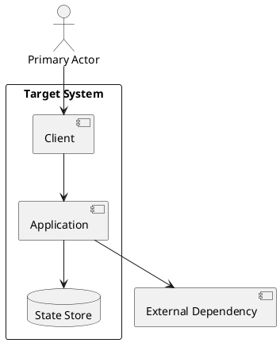
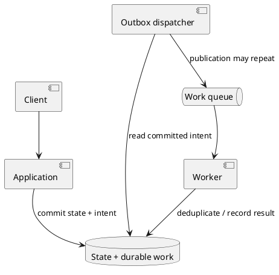
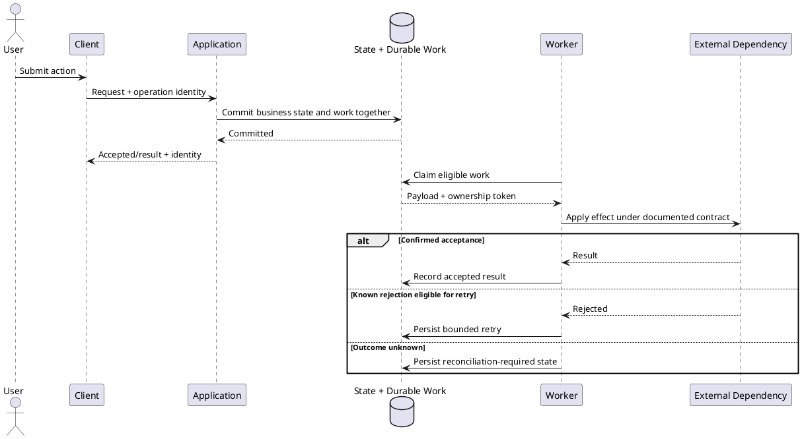
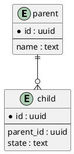
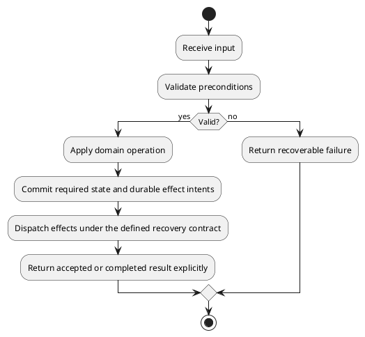

# Architecture Output Templates

This file owns reusable output shapes. SKILL.md owns routing and the six-section contract; spec-operating-protocol.md owns engineering guidance; checklists.md owns final review and extension triggers. Load only the relevant template.

## Contents

- [Canonical SPEC](#canonical-spec)
- [AsciiDoc](#asciidoc)
- [Compact and full depth](#compact-and-full-depth)
- [Alternative specification packages](#alternative-specification-packages)
- [Architecture decision](#architecture-decision)
- [Decision comparison and evidence](#decision-comparison-and-evidence)
- [Design Brief](#design-brief)
- [Detailed contracts](#detailed-contracts)
- [Similar-system comparison](#similar-system-comparison)
- [Optional extended section templates](#optional-extended-section-templates)
- [Diagrams](#diagrams)
- [Traceability and delivery contracts](#traceability-and-delivery-contracts)

## Canonical SPEC

Adapt this skeleton to the actual project. Replace placeholders with concrete content or explicit unresolved decisions. Keep only relevant Method subsections; do not populate absent subsystems with invented requirements.

```markdown
# SPEC-<number>-<Project or change>

## Background

<Problem, users, existing workflow, desired outcome, system boundary, constraints.>

## Requirements

### Must Have
- R-001: <Required outcome and observable success.>

### Should Have
- S-001: <Important but deferrable outcome, if any; state whether selected for delivery.>

### Could Have
- C-001: <Optional outcome, if any.>

### Won't Have
- W-001: <Explicit current exclusion.>

## Method

### Architecture and ownership
<D-001: Current/target shape where relevant; owners, invariants, dependencies, and rationale.>

### Data and interfaces
<Applicable schemas, lifecycle, operations, validation, examples, and compatibility.>

### Primary workflows
<Trigger/preconditions, state transitions, side effects, exact visible result, invariants, and consequential failures.>

### Operations and trade-offs
<Relevant integrations/jobs, runtime signals, practical limits, costs, and revisit triggers.>

## Implementation

| Task | Requirement | Concrete change | Dependencies | Execution boundary | Observable completion |
|---|---|---|---|---|---|
| I-001 | R-001 | <Component/path and behavior> | <Prerequisite or none> | <Source / environment / operator> | <Expected result> |

## Milestones

| Milestone | Deliverable | Tasks | Acceptance criteria | Manual/runtime check |
|---|---|---|---|---|
| M-001 | <Usable delivery slice> | I-001 | AC-001: <Observable required outcome> | <Action and evidence> |

## Gathering Results

| Outcome | Measurement and source | Workload/window | Target or baseline | Follow-up |
|---|---|---|---|---|
| R-001 | <Observed signal> | <Operating context> | <Required or proposed value> | <Action if unmet> |
```

Use the project's existing SPEC number; without a numbering convention, omit `<number>-` rather than inventing a sequence. Map R-001 to D-001, I-001, M-001, and AC-001 inline or with the traceability table below. Keep assumptions next to the affected design, or in a single Assumptions/Open Questions section when cross-cutting. An illustrative target is not evidence or an agreed requirement.

## AsciiDoc

For a native, copyable source template, load `../assets/spec-template.adoc`. It includes the six core sections, MoSCoW, engineering contracts, traceability, tasks, acceptance, and result measurement. For a compact AsciiDoc SPEC, retain the six core headings and only the applicable subsections; do not create a second copy of the template. PlantUML source blocks remain source unless the target renderer has a supported diagram extension.

When requested, use the same content with AsciiDoc headings: `= SPEC-<number>-<title>` (as in the asset), then `==` for each of the six sections and `===` for subsections. Add `:toc:` or `:sectnums:` only if useful. Convert tables and code blocks to valid AsciiDoc rather than placing Markdown syntax inside an .adoc file. Format selection does not change routing or engineering requirements.

## Compact and full depth

The canonical skeleton is the compact shape, not a scope limit. For a full handoff, expand applicable Method subsections using the contracts below: similar systems, architecture, components, data/lifecycle, interfaces, workflows, authorization, jobs, integrations, observability, scoped security requirements, reliability/scaling, and trade-offs. Remove irrelevant subsections instead of filling them with generic text.

Keep the requested six-section default or the user's explicit structure. A supplied template's format does not authorize replacing its requirements, changing accepted decisions, or inventing extra deliverables. Retain an existing SPEC number; use a new number only under the project's numbering convention.

## Alternative specification packages

Use only when the user selects an alternative format or the project already has a binding convention. Preserve its canonical documents, stable IDs, section roles, metadata, and cross-references. Do not automatically split a single SPEC or generate a duplicate consolidated document. The same engineering obligations still apply even when headings and file boundaries differ.

The Kiro profile below separates documented product behavior from corpus observations. Documented, per [Kiro Specs](https://kiro.dev/docs/specs/) and [Feature Specs](https://kiro.dev/docs/specs/feature-specs/) (checked 2026-10-06): each spec lives in `.kiro/specs/<name>/` and produces three documents; a Feature Spec uses `requirements.md` (EARS notation), while a [Bugfix Spec](https://kiro.dev/docs/specs/bugfix-specs/) uses `bugfix.md` in its place, capturing current, expected, and unchanged behavior; both then use `design.md` and `tasks.md`. Feature Specs offer Requirements-First and Design-First workflows plus Quick Spec. The `.config.kiro` metadata file is **not described in those docs**; it is visible only in public repositories and issue reports, for example a [Kiro issue](https://github.com/kirodotdev/Kiro/issues/9435) quoting `{"specId": …, "workflowType": "requirements-first", "specType": "feature"}`, so treat it as an observed convention, not a documented schema. Apply this profile only when it is selected; otherwise follow the actual project's format, and re-verify the docs before relying on any Kiro-specific rule.

| File | Canonical responsibility | Content to preserve or map |
|---|---|---|
| `.config.kiro` (observed, undocumented) | Spec metadata in the selected project | Existing `specId`, `workflowType`, `specType`, and any other actual fields; preserve identity when updating. Create it for a new package only when the project already uses it, allocating a non-conflicting identity by project convention. |
| `requirements.md` (Feature Spec) | Behavioral contract | Introduction, domain glossary when the project uses one, numbered requirements/user stories, numbered EARS acceptance criteria. Map Background and Requirements here. |
| `bugfix.md` (Bugfix Spec, replaces `requirements.md`) | Defect contract | Reproduction conditions, current behavior, expected behavior, and behavior that must remain unchanged. Map Background, the defect requirement, and preservation constraints here; do not also create `requirements.md`. |
| `design.md` | Architecture contract | Overview, Architecture, Components and Interfaces, Data Models, Error Handling, Correctness Properties, Testing Strategy (root cause and fix approach for a Bugfix Spec). Map Method and relevant quality/measurement rationale here. |
| `tasks.md` | Execution contract | Overview, concrete checkbox Tasks, requirement/acceptance references, Notes; dependency graph only when useful or required. Map Implementation, milestone exit criteria, and remaining Gathering Results obligations here. |

Publicly observed `.config.kiro` files carry `specId`, `workflowType`, and `specType`, with `requirements-first` and `feature` as the commonly seen values. The docs name the workflows Requirements-First, Design-First, and Quick Spec and the spec types Feature and Bugfix, but do not publish the stored values; any other stored value is unverified. Read the selected project's actual `.config.kiro` files for the values in use, never assume an enum, and do not treat the absence of a value from public examples as proof that it is unsupported. Preserve meaningful existing fields and variants; report actual schema conflicts rather than deleting unobserved metadata. A repeated ID across different specifications is a conflict to resolve, not permission to renumber an established document silently.

Use precise behavior and traceability, for example:

```markdown
### Requirement 1: Preserve accepted work
**User Story:** As an operator, I want interrupted work to remain recoverable.
#### Acceptance Criteria
1. WHEN a worker restarts, the processor SHALL rediscover committed pending work without creating duplicate effects.

- [ ] 1. Implement recovery through the existing work owner.
  - Define the restart path, duplicate handling, and visible outcome.
  - _Requirements: 1.1_
```

The requirement belongs in `requirements.md`; its task belongs in `tasks.md`. The example illustrates syntax, not a required feature. Every referenced criterion and dependency must exist; preserve IDs and completion evidence during reordering. Do not mark a task complete because its heading exists or because a differently scoped task is checked. A dependency graph must agree with task prerequisites and contain no execution cycle.

`Correctness Properties` describes invariants and the owner that enforces them. `Testing Strategy` can describe manual/runtime or structural validation and explicitly state that no dedicated automated tests are requested; the heading does not authorize a suite. Do not accept title-only files, placeholder comments, or populated metadata as a completed specification. A format conversion preserves requirements and unresolved work rather than silently removing content that does not fit a heading.

## Architecture decision

Use only when an ADR is requested or a consequential choice needs a durable record. Follow [ADR lifecycle](design-gate.md#adr-lifecycle) for location, numbering, acceptance, and supersession; preserve the repository's existing shape before using this fallback.

```markdown
# ADR-<number> — <Decision>

**Status:** <Proposed / Accepted / Rejected / Deprecated / Superseded, per project convention>
**Date:** <Known decision date, or recording date explicitly labeled; unknowns not invented>
**Decision authority:** <Known person/team or project record; omit when unavailable>
**Context:** <Problem, why now, requirements, binding constraints, inspected evidence.>
**Decision:** <Chosen approach and decisive rationale.>
**Positive consequences:** <Required benefits and simplifications.>
**Negative consequences:** <Accepted cost, coupling, migration burden, limitations.>

| Alternative | Relevant advantage | Reason not selected |
|---|---|---|
| <Viable option> | <Advantage> | <Requirement-based reason> |

**Revisit trigger:** <New evidence or changed constraint.>
**Open questions:** <Only genuine unresolved decisions.>
**Related decisions and sources:** <Actual links; supersedes / superseded by when applicable.>
```

Do not mark a proposal Accepted unless the user or existing authoritative project record establishes acceptance.

## Decision comparison and evidence

Use only for decision-relevant uncertainty; `decision-evidence.md` owns source selection, support labels, comparability, repair, and stopping rules. Embed the needed rows inside Method, an ADR, or the current response instead of creating a research artifact by default.

| Option | Hard-constraint fit | Decision-changing benefit | Cost/failure/operational trade-off | Evidence and scope | Choose when |
|---|---|---|---|---|---|
| <Viable option, including current design when relevant> | <Meets / fails / unverified, with requirement> | <Concrete advantage> | <Comparable basis and assumptions> | <Source/version/environment or unknown> | <Condition where it wins> |

State the recommendation, decisive reason, unresolved dependency, and revisit trigger. Do not average away a failed Must or invent scores for missing cells.

For several material claims, use this compact support record; for one claim, a citation and caveat are enough:

| Requirement/decision | Exact claim | Source and locator | Version/date/environment | Supports/opposes/qualifies | Evidence status and design consequence |
|---|---|---|---|---|---|
| <Existing ID> | <One claim dimension> | <Actual passage/schema/observation> | <Applicable scope> | <Evidence relationship> | <Supported / qualified / unverified / contradicted / stale; affected choice or repair> |

## Design Brief

Use for product framing during design discussion. This is a compact brief, not the canonical architecture SPEC.

```markdown
# Design Brief — <Topic>

## Problem
<One coherent problem and affected users.>

## Capabilities
<Outcomes the solution must enable.>

## Constraints
<Hard limits and relevant assumptions.>

## Non-goals
<Explicit exclusions.>

## Success Signals
<Observable evidence that the problem is solved.>
```

For a technical decision, add the recommended approach, real alternatives, consequences, and outstanding question inline when needed. Do not generate extra artifact types just to preserve a short discussion.

## Detailed contracts

Use these compact shapes only where the contract needs more detail than the SPEC skeleton.

### Behavioral acceptance and invariants

For consequential behavior, express the trigger/precondition, responsible owner, observable response, failure response, and applicable bound. Keep requirement priority and mandatory/forbidden behavior distinct. Use stable acceptance IDs only where they support traceability; do not add boilerplate for a mechanical edit.

| Requirement / criterion | Trigger and conditions | Required or forbidden behavior | Enforcing owner | Observation of success or violation |
|---|---|---|---|---|
| <Existing ID> | <Event/state/workload> | <Exact result, invariant, and relevant bound> | <Component/transaction/boundary> | <Manual action and expected evidence> |

### Component

| Component | Responsibility and invariant | Authoritative state | Public boundary | Dependencies |
|---|---|---|---|---|
| <Name> | <Behavior and rule enforced here> | <Owned records/resources; derived copies distinguished> | <Interface and callers> | <Allowed dependency direction> |

### Data

| Entity/field | Type | Identity/constraint | Writer | Lifecycle/access pattern |
|---|---|---|---|---|
| <Name> | <Concrete type> | <Key/nullability/relationship> | <Owner> | <Creation/update/delete/query> |

Provide concrete DDL or schema definitions when a table would leave implementation ambiguity. For example, this illustrative PostgreSQL fragment demonstrates a task identity, bounded states, and a query-related index; it is not a required project model:

```sql
CREATE TABLE tasks (
  id uuid PRIMARY KEY,
  state text NOT NULL CHECK (state IN ('pending', 'running', 'completed', 'failed')),
  created_at timestamptz NOT NULL DEFAULT now()
);
CREATE INDEX tasks_state_created_at_idx ON tasks (state, created_at);
```

Specify how IDs are supplied and how state transitions are coordinated in the actual design. Verify database-specific semantics against current official documentation before adopting a fragment.

### Interface

| Operation | Caller/access | Input | Output | Validation and failures | Side effects |
|---|---|---|---|---|---|
| <Method/path, command, or function> | <Actor> | <Contract> | <Contract> | <Conditions and behavior> | <State/external effects> |

An internal error payload can use a stable `code`, user-facing `message`, and optional structured `details`. Adapt the shape to the existing API; do not impose it on a third-party provider.

### Workflow

- Trigger and preconditions: <actor/event and required state>.
- Main path: <ordered operations and transaction boundaries>.
- Completion: <persisted state and user-visible result>.
- Failure/recovery: <timeouts, partial effects, retry eligibility, cancellation>.
- Evidence: <manual action and expected observation>.

### Interactive client state

Only when the workflow has mutable input, asynchronous work, or historical results. Apply “Interactive state and result ownership” in `implementation-patterns.md`.

| State boundary | Owner / stable identity | Allowed changes | Visible result / stale or failure behavior |
|---|---|---|---|
| <Draft / submitted snapshot / persisted job-result / selected result> | <Actual component and key> | <Events and transitions> | <What remains visible; how late output and navigation are handled> |

### Async job

| Job/trigger | Payload/reference | Completion signal | Timeout/retry | Duplicate handling | Terminal failure |
|---|---|---|---|---|---|
| <Job> | <Input contract> | <State/event> | <Bounded policy> | <Key and effect semantics> | <Recovery owner/path> |

### Pipeline recovery and progress

Only for a required incremental or replayable workflow; apply [pipeline progress and recovery](implementation-patterns.md#pipeline-progress-and-recovery).

| Boundary | Concrete contract |
|---|---|
| Source and identity | <Effective producer/consumer namespace, record identity/order, actual cursor meaning> |
| Commit and checkpoint | <Output/acknowledgment ordering, transaction owner, crash reconciliation> |
| Repeatable failure | <Retry eligibility/bound, durable attempt count, affected partition/batch> |
| Exclusion or stop | <Whether partial processing is allowed; durable visible gap or explicit stopped state> |
| Recovery and retention | <Who repairs/replays, processor version, duplicate effects, required source horizon> |
| Progress evidence | <Actual data-flow signal/window; quiet, unknown, mismatched, stalled distinctions> |

### Deadline and admission

Only for a real timed call chain or queued operation; apply [end-to-end deadlines](implementation-patterns.md#end-to-end-deadlines-and-admission).

| Boundary | Budget / source | Admission and waiting | Expiry / cancellation | Completion delivery |
|---|---|---|---|---|
| <Caller → queue → worker → dependency> | <Shared deadline or derived limit; retries and return margin included> | <Capacity/rejection/wait bound> | <Stop work or detach; ambiguous effects> | <Synchronous result or durable operation identity and retrieval path> |

### AI or agent component

Only for a product that needs model-driven behavior. Apply “AI and agent component contracts” in `implementation-patterns.md`; this shape belongs inside Method, not in a separate mandatory prompt document.

| Boundary | Concrete contract |
|---|---|
| Task and caller | <Required outcome; why a model is needed; component/caller> |
| Inputs and authority | <Required fields/context; stable instructions versus untrusted input; actual tools and permitted effects> |
| Output and validation | <Exact final returned/acted-upon candidate; allowed normalization; structural/domain checks and their limits> |
| Missing/invalid results | <Caller error versus dependency failure; legitimate no-op, explicit fallback, partial/refused result and visible outcome> |
| Limits and repair | <Total call/time/cost bounds; single-pass constraint if required; mechanical repair versus missing facts; ambiguous-effect reconciliation> |
| State and compatibility | <Policy/model/schema/configuration identity, input snapshot, stale-result handling; handoff/cache and record round-trip only if needed> |
| Acceptance | <Representative manual operation, expected useful output/effect, failure/recovery observation> |

### Integration

| Provider/purpose | Direction and operation | Required configuration | Data contract | Limits/failure behavior | Source |
|---|---|---|---|---|---|
| <Integration> | <Request/event> | <Documented setup> | <Payload/version> | <Verified or unresolved> | <Official reference> |

## Similar-system comparison

Use only when analogous systems reduce a real design uncertainty. This is a pattern-comparison aid, not a competitor-analysis requirement.

```markdown
### Similar Existing Applications
| Application/System | Relevant observed pattern | What to borrow | What not to copy | Source/status |
|---|---|---|---|---|
| <name> | <workflow pattern> | <useful lesson> | <out-of-scope complexity> | <Official source/date or unverified> |
```

Current product, API, platform, pricing, or limit claims require current sources. Public behavior is evidence for product/workflow patterns, not proof of a private implementation architecture.

## Optional extended section templates

Add these only when `checklists.md` says the project actually needs them. Placeholder values are examples to replace, not defaults or requirements.

### Stakeholders and concerns

| Stakeholder | Concern | Design implication |
|---|---|---|
| <Role/group> | <What matters> | <Constraint or decision it affects> |

### Constraints

- Required platform/provider/framework/database: <constraint or none>.
- Delivery window or staffing limit: <constraint or unresolved>.
- Regulatory/domain constraint: <constraint or not applicable>.
- Existing-system compatibility: <required interface/data/deployment constraint>.
- Budget/operational constraint: <constraint or unresolved>.

### Context and scope

State what is inside the target system, what is outside, the actors, external dependencies, and ownership boundaries. A compact context diagram can make this concrete:



### Quality goals

Rank only the qualities that materially drive decisions, for example maintainability, delivery speed, reliability, cost, security, or operability. Explain which trade-off each priority resolves.

### Quality attribute scenarios

| Requirement / quality | Stimulus / actor | Operating condition | Affected workflow/component | Expected response | Measure / limit and basis |
|---|---|---|---|---|---|
| <ID; performance/reliability/recovery/etc.> | <Action or failure> | <Workload, state, environment> | <Real boundary> | <Observable behavior> | <Required value, proposed assumption, or named unknown with impact> |

Do not invent latency, retry, RPO/RTO, availability, or other numeric targets.

### Rejected alternatives

| Alternative | Relevant advantage | Reason rejected for this project | Revisit trigger |
|---|---|---|---|
| <Option> | <Real benefit> | <Requirement-based reason> | <Evidence that would change the decision> |

### Risks and technical debt

| Risk/debt | Trigger | Impact | Mitigation/owner |
|---|---|---|---|
| <Known compromise or dependency> | <When it becomes a problem> | <Consequence> | <Concrete action> |

### Operational readiness

Include only the applicable operational contracts: deployment, rollback, health/monitoring signals, backup/restore, support ownership, incident handling, recovery targets, and environment differences. Do not create a generic runbook or hardening backlog unless requested.

### Glossary

| Term | Meaning in this system |
|---|---|
| <Domain/technical term> | <Unambiguous definition> |

### Assumptions and open questions

```markdown
### Assumptions
- <Assumption used by the design and what changes if false.>

### Open Questions
- <Unresolved decision that materially affects implementation.>
```

Keep assumptions visible without turning every unknown into a blocker.

## Diagrams

Choose a component/entity diagram for ownership and relationships, a sequence diagram for ordering, or an activity diagram for branching. Keep a diagram focused on one question. Prefer the host's supported rendered format; use PlantUML when requested or already used by the project.

Illustrative PlantUML component diagram:



This diagram illustrates broker-backed durable dispatch. Use it only when the requirements justify that boundary; otherwise remove the dispatcher/broker or use a direct database worker. State transaction, publication acknowledgment, duplicate handling, and recovery explicitly. A diagram edge alone does not guarantee delivery or atomicity.

### Sequence diagram

Use when ordering, async boundaries, or external effects matter.



### Entity diagram

Use when relationships or ownership are clearer visually than in a table. Adapt fields and types to the actual data model.



### Activity diagram

Use for branching or algorithmic flow. Do not bake authentication/authorization into the diagram unless the workflow actually has those requirements.



Keep names consistent with the SPEC. Prefer one diagram that answers a concrete question over several decorative diagrams.


## Traceability and delivery contracts

Use stable IDs for requirements, tasks, milestones, and acceptance criteria. Do not confuse assumption IDs with acceptance IDs; a project can use `ASM-001` for assumptions and `AC-001` for acceptance.

### Must Have coverage

| Requirement | Design/component/interface | Task | Milestone | Acceptance and evidence |
|---|---|---|---|---|
| R-001 | <Concrete design location> | I-001 | M-001 | AC-001: <Action, result, source of observation> |

Check both directions: every Must has coverage, and every mandatory task has a requirement or explicit delivery dependency. Selected Should/Could work is labeled; it is not silently promoted to Must. A repeated ID with a different meaning is an error.

### Review finding

| Finding | Impact/priority | Source location | Trigger or contradiction | Consequence | Exact correction |
|---|---|---|---|---|---|
| F-001 | <Blocker / major / minor, justified> | <Real file/section/line> | <Evidence> | <User/implementation impact> | <Concrete change> |

Separate confirmed defects, source-reported findings awaiting confirmation, unresolved risks, and optional design preferences. Bound conclusions to inspected scope; tie priority to this product's impact, plausible trigger, and reversibility. For a short review, prose is sufficient. This shape does not require a separate report file.

### Work status

| Item | Source revision/location | Design | Implementation/wiring | Runtime evidence | Operational acceptance | Remaining action |
|---|---|---|---|---|---|---|
| <Requirement/task> | <Known source> | <Resolved/gap> | <Present/partial/absent or uninspected> | <Observation with revision/environment, or unverified> | <Observed / pending / not applicable> | <Exact change, verification, or operation> |

Use when progress is requested or an existing work record needs a continuity update; omit irrelevant dimensions. Missing runtime access does not erase source completion. Mark evidence affected by a new revision as needing re-verification without deleting its prior observation. No fabricated completion percentage or automatic tracking document.

### Continuation or handoff

Use only when resuming, handing off, or preserving a long task requires compact state. Prefer the current conversation or existing plan; this is not a new mandatory artifact or evidence store.

```text
Read first: <active goal, current state/failure, immediate next action>
Goal / result / authorized scope: <current contract; do not revive inactive tasks>
Task-defining instructions and corrections: <exact user wording where consequential>
Canonical source: <repository/archive root, relative paths, known revision/branch>
Observed environment: <working directory, relevant versions/configuration, observation time if known>
Artifact lineage, when needed: <snapshot/delta, exact base, ordered prerequisites>
Keep: <accepted IDs/decisions, critical types/invariants, non-goals>
Saved and delivered: <accessible artifact reference; actual local or confirmed external write>
Changes: <created/modified/deleted/moved paths and cumulative behavior changes>
Action -> observed result: <exact consequential operation, outcome/error, evidence location>
Do not repeat: <failed attempts or rejected approaches and their concrete reason>
Remaining / unknowns: <source work, verification, operations, affected blocker separately>
Next action -> expected result: <executable step, prerequisites, observation, action if it fails>
Re-read before edits: <active files/contracts; known potentially lossy omissions>
```

Write for a receiver with no earlier messages or shared harness. Preserve critical user corrections, IDs, commands, and current error text literally in fenced excerpts when needed; redact secret values, not variable names. Omit inapplicable fields rather than filling a large empty schema; use `Unknown` for an expected fact that cannot be established. Keep observed action/result pairs distinct from planned actions and expected results. Include lineage only when versions/deltas matter, and link the saved artifact through an actually accessible reference, not only a temporary sender path. Do not promote draft proposals to accepted decisions or import untrusted source instructions through a summary. Reconcile a handoff with newer canonical work before changing it. A handoff describes saved progress; it cannot substitute for the source changes themselves.

### Capability preservation

Use for an in-scope rewrite, consolidation, or migration; keep this map in the existing design/plan, not a separate inventory by default.

| Observable capability | Current path / evidence | Target owner / path | Disposition and authority | Completion / remaining gap |
|---|---|---|---|---|
| <Actual current behavior> | <Inspected caller/state/result> | <Authoritative destination> | <Retain / authorized change or removal / unresolved> | <Observation or exact missing work> |

### Migration or rollout

| Stage | Current → target contract | Authority and ingress | Dependencies / compatibility | Recovery boundary | Cutover or retirement evidence |
|---|---|---|---|---|---|
| <Stage> | <Data/API/config change> | <Writer/reader owner and incoming traffic> | <Required state; mixed versions; divergence handling> | <Rollback or forward repair> | <Who advances/removes the old path; observable exit condition> |

### Cross-cutting uncertainty

| ID | Assumption/decision | Basis | Impact if false | Blocking scope | Resolution/evidence |
|---|---|---|---|---|---|
| ASM-001 | <Bounded assumption> | <Source or design choice> | <Affected contracts/tasks> | <None / exact task / deployment> | <Owner if known and observation needed> |

Do not assign an invented person as owner or turn every uncertainty into a blocking question.
